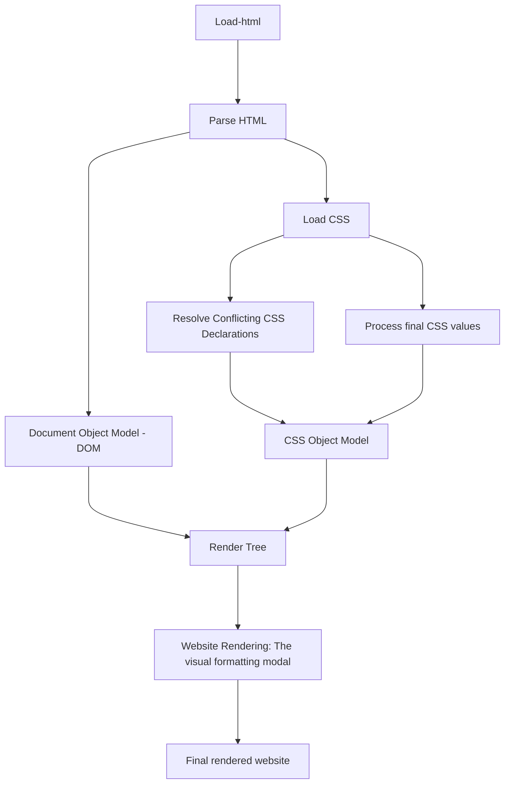
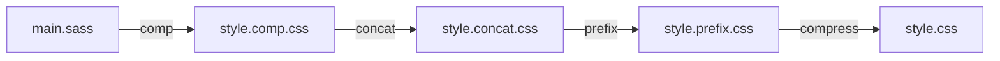

# 1. CSS Knowledge, 

## 1.1 What behind it ?
Three Pillars to werite good HTML and CSS
- **Responsive design**: fluid layouts, media queruesm, responsive images, correct units, desktop-first vs mobile-first;
- **Maintainable and scalable code**: clean, easy to understand, growth, ruable, organize files, name classes, structure HTML
- **Web performance**: less HTTP request, less code, compress code, css preprocessor, less images, compress images

What happends to css when we load up a website:



### 1.1.1 The Cascade and Specificity

The Cascade: Process combining different stylesheets and resolving conflict between different CSS rules and decalrations, when more than one rule applies to a certain element.

CSS different sources: Auther, user, browser(user agent);
- **Importance > specificity > source order**
1. Importance: User ! > Author ! > Author declarations > user declarations > default browser declarations
2. Specificity: THen count by +1 with: inline styles, IDs, Classes pseudo-classes attribute, Elements, pseudo-elements; and compare from the scroe from left to right; (0, 1, 2, 1) > (0, 0, 3, 1) > (0, 0, 3, 0)
3. The last declaration in the code will override all other devlarations and will be applied;

**Tips:**
1. CSS declarations marked with !important have the highest priority;
2. But, only use !important as a last resource. It’s better to use correct specificities — more
3. maintainable code!
4. Inline styles will always have priority over styles in external stylesheets;
5. A selector that contains 1 ID is more specific than one with 1000 classes;
6. A selector that contains 1 class is more specific than one with 1000 elements;
7. The universal selector * has no specificity value (0, 0, 0, 0);
8. Rely more on specificity than on the order of selectors;
9. But, rely on order when using 3rd-party stylesheets — always put your author stylesheet last.

### 1.1.2 Value Processing

How processed:


em is for parents, and rem is for root; Globally wif we use rem for all proect, its more easy for us to control the size;

vh is for view port height, vw is for viewport width;

**Tips:**

### 1.1.3 How CSS render website, Visual formatting model

1. Dimensions of boxes: the box model;
• Content: text, images, etc;
• Padding: transparent area around the content, inside of the box;
• Border: goes around the padding and the content;
• Margin: space between boxes;
• Fill area: area that gets filled with background color or background image.

2. Box type: inline, block and inline-block;
See - chapter 4 table;

3. Positioning scheme: floats and positioning;
- Normal flows: • Default positioning scheme; • NOT floated; • NOT absolutely positioned; • Elements laid out according to their source order.
- Floats: • Element is removed from the normal flow; • Text and inline elements will wrap around the floated element; • The container will not adjust its height to the element.
- Abosolute positioning: Element is removed from the normal flow • No impact on surrounding content or elements; • We use top, bottom, left and right to offset the element from its relatively positioned container.

4. Stacking contexts;
- z-index

5. Other elements in the render tree;

6. Viewport size, dimensions of images, etc.

### 1.1.4 CSS architecture, components and BEM

1. Think: Componnent-driven design

2. BUild: Block Element Modifier( BEM )
- Block: standlone component that is meaningful on its own
- Element: part of a block that has no stadalone meaning
- Modifier: a different version of a block or an element

1. Architect: The 7-1 pattern
- 7 different folders for partial Sass files (base/, components/, layout, pages/, themes/, abstract/, vendors/)
- 1 main Sass file to import all oteher file into a compiled CSS sty;esheet

## 1.2 Responsive Design

Pricinples:
1. Fluid Layouts
- Allow webpage to adapt to the current viewport width
- Use &(or vh/vw) unit instad of px for elements that should adapt to viewport
- Use max-widtg instad of width (if we have enough space, it count specify width, if not, it count full width of cuurent width)
2. Responsive Units
- Use Rem unit instad of px for most lengths
- To make it easy to scalue the entire layout down automatically
3. Flexible images
- By default, images don't scale automatically as we change the viewport, so we need to fix that;
- Always use % for image dimensiuons, together with the max-width property
4. Media Queries
- To change CSS styles on certion viewport width(called breakpoints)

### 1.2.1 Responsive Design Between Mobile and PC

- DeskTop First: we use `@media(max-width:xxxpx)` to dadapt shrink design in smaller screens
- Mobile First: oppsite use min-wwidth

always the larger one before the smaller one when using min-width(work from large sceen)

Then at each scss place, place these specify padding, coloum, or size or something else wo adpt the screen
```scss
@mixin respond($breakpoint) {
  @if $breakpoint == phone { // 600px
    @media (max-width: 37.5em) { @content; }
  }

  @if $breakpoint == tab-port { // 900px
    @media (max-width: 56.25em) { @content; }
  }

  ...

  @if $breakpoint == big-desktop { // 1800px
    @media (min-width: 112.5em) { @content; }
  }
}


html {
  // This defines what 1rem is
  font-size: 62.5%;

  // always the larger one before the smaller one
  @include respond(tab-land) { // width < 1200px
    font-size: 56.25%;
  }

  @include respond(tab-port) { // width < 900px
    font-size: 50%;
  }

  ...

  @include respond(big-desktop) { // width > 1800px
    font-size: 75%;
  }
}
```


### 1.2.2 Responsive Image

Serve the right image to the right screen size ad device, in order to avoid downloading unncessary large image on smaller devices;

- Resolution switching: decrease image resolution on smaller screen
- Density switching: hald of the image resolution on @1x screeen compared to 2x
- Art Direction: different iamge on smaller screen

#### 1.2.2.1 Resolution switching
300w 1000w mark the resolution of these two picture.

The browser's selection mechanism chooses the image resource from the srcset based on the viewport width and the rules in sizes. For example, if the calculated required width is 250px, it'll pick the 300w image; if it's 800px, it'll select the 1000w one.

```scss

```

#### 1.2.2.1 Density switching
1x 2x is the target of the density switching
```scss

```

#### 1.2.2.1 Art Direction
one img and another img on another
```scss
<picture class="footer__logo">
    <source srcset="img/logo-green-small-1x.png 1x, img/logo-green-small-2x.png 2x"
            media="(max-width: 37.5em)">
    
</picture>
```

**Example for background img detect:**
```scss
@media only screen and (min-resolution: 192dpi) and (min-width: 37.5em),
        only screen and (-webkit-min-device-pixel-ratio: 2) and (min-width: 37.5em),
        only screen and (min-width: 125em) {
    background-image: linear-gradient(
        to right bottom,
        rgba($color-primary-light, 0.8),
        rgba($color-primary-dark, 0.8)),
    url(../img/hero.jpg);
}
```

### 1.2.3 Browser Support @supports

check in https://caniuse.com; 

```scss
@supports (-webkit-backdrop-filter: blur(10px)) or (backdrop-filter: blur(10px)) {
    -webkit-backdrop-filter: blur(10px);
    backdrop-filter: blur(10px);
    background-color: rgba($color-black, .3);
}
```
## 1.3 Build Process



### 1.3.1 config in package.json
```json
"scripts": {
    "watch:sass": "node-sass sass/main.scss css/style.css -w",
    "devserver": "live-server",
    "start": "npm-run-all --parallel devserver watch:sass",

    "compile:sass": "node-sass sass/main.scss css/style.comp.css",
    "concat:css": "concat -o css/style.concat.css css/icon-font.css css/style.comp.css",
    "prefix:css": "postcss --use autoprefixer -b 'last 10 versions' css/style.concat.css -o css/style.prefix.css",
    "compress:css": "node-sass css/style.prefix.css css/style.css --output-style compressed",
    "build:css": "npm-run-all compile:sass concat:css prefix:css compress:css"
},
```


# 2. CSS Basic Feature and Usage

## 2.1 Position

### 2.1.1 Algin middle or other position
**align in the middle**
- When child using absolute, give parent relative, so child can positioned inside parent abosult;
```css
// we can create a mixin public method and re-used
@mixin absCenter {
    position: absolute;
    top: 50%;
    left: 50%;
    transform: translate(-50%, -50%);
}
```

- using flex for center
```css
.clock-container {
  display: flex;
  justify-content: center;
  align-items: center;
}
```

### 2.2.2 Design Overlay Pictures

best practise is using absolute positioning
```scss
.composition {
  position: relative; // makeing all relativem and each absolute position

  &__photo {
    width: 55%;
    box-shadow: 0 1.5rem 4rem rgba($color-black, 0.4);
    border-radius: 2px;

    position: absolute;

    &--p1 {
      left: 0;
      top: -2rem;
    }

    &--p2 {
      right: 0;
      top: 2rem;
    }

    &--p3 {
      left: 20%;
      top: 10rem;
    }
  }
}
```

### 2.1.3 text align

1. make an area with two colum text
```scss
column-count: 2;
column-gap: 4rem; //1em = 14px;
column-rule: 1px solid $color-grey-light-2;
```

### 2.1.4 All align related position compare


| **Property**           | **Applies To**                          | **Description**                                                                 | **Default Value**       | **Use Case / Example**                                                                                      |
|------------------------|-----------------------------------------|---------------------------------------------------------------------------------|-------------------------|------------------------------------------------------------------------------------------------------------|
| **`align-items`**       | Flex container (`display: flex`)        | Aligns flex items **along the cross axis** (perpendicular to the main axis).    | `stretch`               | Controls the alignment of items in the flex container, e.g., `align-items: center` to center items vertically. |
| **`align-self`**        | Individual flex item (`display: flex`)  | Aligns a specific flex item **along the cross axis**, overriding `align-items`.| `auto`                  | Aligns one item differently than others, e.g., `align-self: flex-start` for a single item aligned at the top.    |
| **`align-content`**     | Flex container (`display: flex`)        | Aligns multiple lines of flex items **along the cross axis**.                  | `stretch`               | Used when there is more than one line of flex items, e.g., `align-content: space-between`.                      |
| **`justify-content`**   | Flex container (`display: flex`)        | Aligns flex items **along the main axis** (horizontal for row, vertical for column). | `flex-start`          | Controls the distribution of space between items, e.g., `justify-content: center` centers items horizontally.    |
| **`text-align`**        | Block elements (text, inline-blocks)    | Aligns inline content (text, inline elements) **horizontally** within a block. | `left`                  | Aligns text inside a block element, e.g., `text-align: center` centers text horizontally within a container.    |
| **`vertical-align`**    | Inline, inline-block, table-cell elements | Aligns inline-level elements **vertically** within the line height or container. | `baseline`              | Used for vertical alignment in inline elements, e.g., `vertical-align: middle` to align an element vertically in line with surrounding content. |
| **`place-items`**       | Grid container (`display: grid`)        | A shorthand for setting both `align-items` and `justify-items`.                 | `stretch`               | Centers grid items both horizontally and vertically, e.g., `place-items: center`.                             |
| **`place-self`**        | Grid item (`display: grid`)             | A shorthand for setting both `align-self` and `justify-self`.                   | `auto`                  | Aligns individual grid items, e.g., `place-self: center` to center one item in the grid.                      |
| **`justify-items`**     | Grid container (`display: grid`)        | Aligns grid items **horizontally** inside each grid cell.                       | `stretch`               | Controls horizontal alignment within grid cells, e.g., `justify-items: start`.                               |
| **`align-items` (grid)**| Grid container (`display: grid`)        | Aligns grid items **vertically** inside each grid cell.                         | `stretch`               | Controls vertical alignment within grid cells, e.g., `align-items: center`.                                  |
| **`justify-self`**      | Grid item (`display: grid`)             | Aligns an individual grid item **horizontally** within its grid cell.           | `auto`                  | Controls horizontal alignment for individual grid items, e.g., `justify-self: end`.                          |

---

**Explanation of Key Differences**

1. **`align-items` vs `align-self`**
   - **`align-items`**: Applies to the entire flex container and defines the alignment of **all items** along the cross axis. 
   - **`align-self`**: This is a property for individual flex items. It can be used to override the value set by `align-items` for one specific item.

2. **`justify-content` vs `justify-items`**
   - **`justify-content`**: Used in **flex** and **grid** containers to control the **space distribution** between the items along the main axis. It defines the spacing between items and how they are positioned in the container.
   - **`justify-items`**: A property used specifically in **grid layouts** to align grid items **within their grid cells** horizontally.

3. **`align-content` vs `align-items`**
   - **`align-content`**: Only applies when there are **multiple lines** of items in a flex or grid container (like wrapping). It defines how the lines of items are spaced along the cross axis.
   - **`align-items`**: Aligns all items **on the same line** in the container along the cross axis.

4. **`text-align`**
   - **`text-align`**: Used for aligning text or inline elements **horizontally** inside a block-level container (like a div). It affects the content inside the container, not the container itself.

5. **`vertical-align`**
   - **`vertical-align`**: Affects the vertical positioning of inline or inline-block elements relative to their surrounding elements. It is commonly used for text or icons next to each other.

6. **`place-items` vs `align-items`/`justify-items`**
   - **`place-items`**: This is a shorthand property for `align-items` and `justify-items` in grid layouts. It allows for quick alignment both vertically and horizontally within the grid cells.

7. **`place-self` vs `align-self`/`justify-self`**
   - **`place-self`**: A shorthand for setting both `align-self` and `justify-self` on individual grid items. This makes it easier to align individual grid items both horizontally and vertically.

---

**Summary**

- **`align-items`**: Aligns all items along the cross axis (for Flexbox and Grid).
- **`align-self`**: Aligns a specific item along the cross axis, overriding `align-items` (for Flexbox and Grid).
- **`align-content`**: Aligns multiple lines of items along the cross axis (for Flexbox and Grid).
- **`justify-content`**: Aligns items along the main axis (for Flexbox and Grid).
- **`justify-items`**: Aligns grid items horizontally within grid cells.
- **`text-align`**: Aligns inline content (like text) horizontally within its container.
- **`vertical-align`**: Aligns inline or inline-block elements vertically within their line height.
- **`place-items`**: A shorthand for both `align-items` and `justify-items` in grid layouts.
- **`place-self`**: A shorthand for both `align-self` and `justify-self` in grid layouts.


## 2.2 Relation

### 2.2.1 pseudo

#### 2.1.1 pseudo common class
**pseudo class** :hover, :focus, :active, :visited, :link, :disabled, :checked, :selected, :first-child, :last-child, :nth-child, :only-child, :empty, :target, :lang
```css
.btn:link,
.btn:visited { /* pseudo class, used to select elements based on their specific states or pseudo-states. */
    text-transform: uppercase;
    text-decoration: none;
    padding: 10px 40px; /* top/bottom, left/right*/
    display: inline-block;
    border-radius: 100px;
    transition: all .2s; /* all ele to animate */
}
```
sudo class - checked:

```scss
&__radio-input:checked ~ &__radio-label &__radio-button::after {
    opacity: 1;
}
```

#### 2.1.2 ::after ::before

The `::after` pseudo-element in CSS is used to insert content after an element's content. It is often utilized for decorative purposes, such as adding icons, styling, or additional information without needing to modify the HTML structure. Here's a quick overview:


1. **Syntax**:
   ```css
   selector::after {
       content: " "; /* Required property */
       /* Other styling properties */
   }
   ```

2. **Key Properties**:
   - **`content`**: This property is required. It specifies what will be inserted. It can take text, images, or even be empty (for styling purposes).
   - **Styling Properties**: You can apply any CSS property (like color, background, padding, margins, etc.) to style the `::after` content.

3. Example

Here’s an example of using `::after` to add an icon after a list item:

```html
<ul>
    <li>Item 1</li>
    <li>Item 2</li>
    <li>Item 3</li>
</ul>
```

```css
li::after {
    content: " ✔"; /* Adds a checkmark after each list item */
    color: green;  /* Styles the checkmark */
}
```

#### 2.1.3 :not

here mean set everyrow but not last to set thte margin-bottom as gutter vertical:
```scss
.row {
    max-width: $grid-width;
    background-color: #eee;
    margin: 0 auto;

    &:not(:last-child) {
        margin-bottom: $gutter-vertical;
    }
}
```

Advanced Usage Ex: let hovered picture scale up and other picture scale down;

```scss
&__photo:hover {
    transform: scale(1.05) translateY(-.5rem);
    z-index: 20;
}

&:hover &__photo:not(:hover) {
    transform: scale(0.95);
}
```

4. Common Use Cases

- **Decorative Elements**: Add icons or decorative symbols after headings, links, or list items.
- **Clearfix**: Using `::after` to clear floated elements within a container.
- **Custom Styles**: Enhance buttons or form fields by adding visual cues without extra HTML.

### 2.2.2 & usage

In Sass, the & symbol represents the parent selector. Here's a simple example:


```scss
.button {
  color: white;
  & when:hover {
    color: gray;
  }
}
```

In this example, & refers to .button. The code above is equivalent to:


```scss
.button {
  color: white;
}

.button:hover {
  color: gray;
}
```

The & helps in nesting selectors efficiently.

### 2.2.3 Sibling selector

The sibling selector targets elements that are directly adjacent to the specified element in the HTML document, sharing the same parent element.
```scss
&__input:placeholder-shown + &__label {
    opacity: 0;
    visibility: hidden;
    transform: translateY(-4rem);
}
```

- `& + &` adjacent silbing selectors to remove or add style when same element adjacent
```css
/**
 - Add a top border to paragraphs,
 - but remove that border when a preceding paragraph already has one.
 */
p {
    border-top: 1px solid gray;
        & + & {
    border-top: 0;
    }
}
```


## 2.3 Style Effect

### 2.3.1 Adding shadow

```scss
// to add a click button shadow
.btn:hover {
    transform: translateY(-3px);
    box-shadow: 0 10px 20px rgba(0,0,0,.2); // creates a shadow beneath the element, offset by 5 pixels vertically, with a spread of 10 pixels, in a light gray color with 20% opacity.
}
.btn:active {
    transform: translateY(-1px);
    box-shadow: 0 5px 10px rgba(0,0,0,.2);
}
```

### 2.3.2 Clip: Make text color gradient from one side to another

1. linear-gradient
```scss
.heading-secondary {
  font-size: 3.5rem;
  text-transform: uppercase;
  font-weight: 700;

  display: inline-block;
  background-image: linear-gradient(to right, $color-primary-light, $color-primary-dark);
  background-clip: text;
  color: transparent;
}   
```

also can use circle to make picture or model as a circle;
```scss
&__shape {
    width: 15rem;
    height: 15rem;
    background-color: orangered;
    float: left;
    -webkit-shape-outside: circle(50% at 50% 50%);
    shape-outside: circle(50% at 50% 50%);

    -webkit-clip-path: circle(50% at 50% 50%);
    clip-path: circle(50% at 50% 50%);

    transform: translateX(-3rem);
}
```
2. radial-gradient - from central to outside
```scss
background-image: radial-gradient($color-primary-light, $color-primary-dark);
```

### 2.3.3 outline: adding outline border around element

```scss
outline-offset: 2rem;
outline: 1.5rem solid $color-primary;
```

### 2.3.4 background-blend-mode: Make background render picture

```scss
 &__picture {
    background-size: cover;
    height: 23rem;
    background-blend-mode: screen; // here can let the background linear gradient color to cover img color

    &--1 {
        background-image: linear-gradient(to right bottom, $color-secondary-light, $color-secondary-dark), url(../../img/nat-5.jpg);
    }
}
```
gradient background with shadow to full color of a picture:

```scss
background-image: linear-gradient(
      105deg,
      rgba($color-white, 0.9) 0%,
      rgba($color-white, 0.9) 50%,
      transparent 50%
    ),
    url(../../img/nat-10.jpg);
```


### 2.3.5 filter: make content blur

```scss
&:hover &__img {
    transform: translateX(-4rem) scale(1);

    filter: blur(3px) brightness(80%);
}
```

### 2.3.6 change the selection text style

```scss
::selection {
    background-color: $color-primary;
    color: $color-white;
}
```

### 2.3.7 using mask
Putting an image directly shows the whole image with its own appearance and may cover original styles and occupy space, 

while using a mask shapes the visible area of an element with the mask's shape without covering original styles and not occupying extra space independently. 

Mask is often used in scenarios where you want to create special visual effects like revealing only certain parts of an element.
```scss
&__item::before {
    content: "";
    display: inline-block;
    height: 1rem;
    width: 1rem;
    margin-right: .7rem;

    // Older browsers
    background-image: url(../img/chevron-thin-right.svg);
    background-size: cover;

    //Newer browsers - masks
    @supports (-webkit-mask-image: url()) or (mask-image: url()) {
        background-color: var(--color-primary);
        -webkit-mask-image: url(../img/chevron-thin-right.svg);
        -webkit-mask-size: cover;
        mask-image: url(../img/chevron-thin-right.svg);
        mask-size: cover;
        background-image: none;
    }
}
```

## 2.4 Some usage of CSS content


### 2.4.1 clearfix

The clearfix is a technique used in CSS to contain floats (like images or divs with float: left;), preventing them from affecting the layout of subsequent elements. Here's a simple example using the clearfix hack:


```scss
<!DOCTYPE html>
<html lang="en">
    <head>
        <meta charset="UTF-8">
        <meta name="viewport" content="width=device-width, initial-scale=1.0">
        <style>
        .clearfix:after {
            content: "";
            display: table;
            clear: both;
        }
        
        .clearfix {
            zoom: 1; /* For IE < 9 */
        }

        .box {
            width: 100px;
            height: 100px;
            margin: 10px;
            background-color: lightblue;
            float: left;
        }
        </style>
    </head>
    <body>
        <div class="clearfix">
            <div class="box"></div>
            <div class="box"></div>
            <div class="box"></div>
        </div>
    </body>
</html>
```

In this example, the .clearfix class is used to contain the floated .box elements, ensuring that they do not break out of their container. The :after pseudo-element is used to create the clearing effect, making sure that the parent element wraps around its child elements properly.

### 2.4.2 calc

```scss
width: calc((100% - 2 * #{$gutter-horizontal}) / 3);
```

### 2.4.3 select class with ^ *

```scss
[class^="col-"] { // all calss start with col, using * mean contain XXX;
    background-color: orangered;
    float: left;

    &:not(:last-child) {
        margin-right: $gutter-horizontal;
    }
}
```

## 2.5 Action Effect


## 2.6 Basic CSS

### container and text
```css
.container {
  width: 400px;
  margin: 0 auto;
  margin-bottom: 20px;
  padding: 20px;
  border: 1px solid #ccc;
  border-radius: 5px;
  background: linear-gradient(
    145deg,
    #01060e,
    #4c7cd0
  ); /* Gradient background */
  box-shadow: 0 10px 30px rgba(0, 0, 0, 0.1); /* horizontal, vertic al blur shadowcolor */
}

body {
  font-family: sans-serif;
  background-color: #f4f7fc;
  margin: 0;
  padding: 0;
  /** center content */ 
  display: flex;
  justify-content: center;
  align-items: center;
  height: 100vh;
}

.text {
  font-weight: bold;
  color: #333;
}
```

### button
```css
button {
  background-color: #4CAF50;
  color: white;
  padding: 10px;
  border: none;
  border-radius: 5px;
  width: 100%;
  /** inside button content align */ 
  display: flex;
  align-items: center;
  justify-content: center;
  cursor: pointer;
  transition: background-color 0.3s ease; /* Smooth transition for background color */
}

button:hover {
  background-color: #45a049;
}

button:disabled {
  background-color: #ccc;
  cursor: not-allowed;
}
```

### table
```css
.data-table-container {
  font-family: "Arial", sans-serif;
  margin: 20px;
}

table {
  width: 100%;
  border-collapse: collapse;
  margin-bottom: 20px;
}

th,
td {
  padding: 12px;
  text-align: left;
  border: 1px solid #ddd;
}

th {
  background-color: #f4f4f4;
  font-weight: bold;
}

tr:nth-child(even) {
  background-color: #f9f9f9;
}

tr:hover {
  background-color: #f1f1f1;
}
```

### Transform

```css
transition: all 0.3s ease;

transform: scale(1.05);
```

### model
```css
/* Backdrop when the modal is open */
.modal-backdrop {
  position: fixed; /* Fixed positioning to cover the entire viewport */
  top: 0; /* Align to the top */
  left: 0; /* Align to the left */
  right: 0; /* Align to the right */
  bottom: 0; /* Align to the bottom */
  background-color: rgba(0, 0, 0, 0.5); /* Semi-transparent black background */
  z-index: 999; /* Make sure the backdrop is behind the modal but above other content */
  opacity: 0; /* Initial opacity for fade-in effect */
  animation: fadeIn 0.3s forwards; /* Fade-in animation */
}

/* Modal container */
.modal {
  position: fixed; /* Fixed position to make it stay in the same place when scrolling */
  top: 50%; /* Vertically center the modal */
  left: 50%; /* Horizontally center the modal */
  transform: translate(-50%, -50%); /* Center the modal exactly */
  background-color: white; /* White background for the modal */
  border-radius: 8px; /* Rounded corners */
  box-shadow: 0px 4px 15px rgba(0, 0, 0, 0.1); /* Slight shadow for a lifted effect */
  padding: 20px; /* Padding inside the modal */
  z-index: 1000; /* Make sure the modal is above the backdrop */
  opacity: 0; /* Initial opacity for fade-in effect */
  animation: modalFadeIn 0.3s forwards; /* Fade-in animation */
}

```

## 2.7 Color

Transition of color:

```css
.clock-container {
  background: linear-gradient(
    145deg,
    #01060e,
    #4c7cd0
  ); /* Gradient background */
  border-radius: 20px;
  box-shadow: 0 10px 30px rgba(0, 0, 0, 0.1);
  border: 5px solid #3e7db7;
}
```

# 3 Animation

## 3.1 Basic Usage


### 3.1.1 transform Usage

Transition is always accompany with the use of transform;

1. transform with translate and opacoty
```css
.heading-primary {
    backface-visibility: hidden; /* when animate, rotate, whether backgound can be seen */
}

.heading-primary-main {
    animation-name: moveInLeft; /* animate name, time, delay */
    animation-duration: 1s;
    animation-timing-function: ease-in; /* how process animation */

    transition: moveInLeft 1s ease-in; /* also can use in this way */
    /* 
    animation-iteration-count: 3;
    animation-delay: 3s; 
    */
}

@keyframes moveInLeft {
    0% {
        opacity: 0;
        transform: translateX(100px); /* axis X direction to go, negative value mean goes right, positive to left */
    }

    80% {
        transform: translate(-10px); /* intermedia position go opposite, and go back to 0 */
    }

    100% {
        opacity: 1; /* 100% show */
        transform: translate(0); /* 0 is arrive at position */
    }
}

```

2. transform with skew

```scss
transition: all .2s;

&:hover {
    transform: skewY(2deg) skewX(15deg) scale(1.1);
    text-shadow: .5rem 1rem 2rem rgba($color-black, .2);
}
```

### 3.1.2 using linear-gradian and tranform to achieve color covered

```scss
&__link {
    &:link,
    &:visited {
        display: inline-block;
        font-size: 3rem;
        font-weight: 300;
        padding: 1rem 2rem;
        color: $color-white;
        text-decoration: none;
        text-transform: uppercase;
        background-image: linear-gradient(120deg, transparent 0%, transparent 50%, $color-white 50%); // making inital cover by 50% fully transprant
        background-size: 220%; // meking the previous 50% cover all, so 0% transparent cover all
        transition: all .4s;

        span {
            margin-right: 1.5rem;
            display: inline-block;
        }
    }

    &:hover,
    &:active {
        background-position: 100%; // shift position, so 50% transprant cover all
        color: $color-primary;
        transform: translateX(1rem);
    }
}
```

## 3.2 Specific Style Animate

### 3.2.1 hamburger menu rotate
```scss
//ICON
&__icon {
    position: relative;
    margin-top: 3.5rem;

    &,
    &::before,
    &::after {
        width: 3rem;
        height: 2px;
        background-color: $color-grey-dark-3;
        display: inline-block;
    }

    &::before,
    &::after {
        content: "";
        position: absolute;
        left: 0;
        transition: all .2s;
    }

    &::before { top: -.8rem; }
    &::after { top: .8rem; }
}

&__button:hover &__icon::before {
    top: -1rem;
}

&__button:hover &__icon::after {
    top: 1rem;
}

&__checkbox:checked + &__button &__icon {
    background-color: transparent;
}

&__checkbox:checked + &__button &__icon::before {
    top: 0;
    transform: rotate(135deg);
}

&__checkbox:checked + &__button &__icon::after {
    top: 0;
    transform: rotate(-135deg);
}
```

### 3.2.2 Slide in show tab

The pseudo-element on its left side expands both vertically and horizontally in a smooth, animated way, resembling a slide show-like effect where a narrow bar expands to cover the whole element, and the background color can also change on activation.
```scss
&__item::before {
    content: "";
    position: absolute;
    top: 0;
    left: 0;
    height: 100%;
    width: 3px;
    background-color: var(--color-primary);
    transform: scaleY(0);
    transition: transform .2s,
                width .4s cubic-bezier(1,0,0,1) .2s,
                background-color .1s;
}

&__item:hover::before,
&__item--active::before {
    transform: scaleY(1);
    width: 100%;
}

&__item:active::before {
    background-color: var(--color-primary-light);
}
```

# 4. Display Method

Comparing common CSS `display` property values, including where to use each type, key behaviors, and examples:

| **Display Type**     | **Description**                                  | **Use Case**                             | **Key Behaviors**                                        | **Example**                         |
|----------------------|--------------------------------------------------|------------------------------------------|----------------------------------------------------------|-------------------------------------|
| `block`              | Element takes full width of its container.       | Structural elements like &lt;div&gt;, &lt;p&gt;  | Starts on a new line; full width of the parent container | &lt;div style="display: block"&gt;...</div> |
| `inline`             | Element takes only as much width as content.     | Text or links, e.g., &lt;a&gt;, &lt;span&gt;     | Does not start on a new line; only content width, padding and margins only horizontal(left, right)         | &lt;span style="display: inline"&gt;Text&lt;/span&gt; |
| `inline-block`       | Like `inline` but respects width and height.     | Buttons, images, styled text spans       | Respects set width/height; aligns inline with other elements | &lt;button style="display: inline-block"&gt;Button&lt;/button&gt; |
| `flex`               | Enables flexbox layout for child elements.       | Layout of items in a row/column (grids)  | Aligns child elements horizontally/vertically            | &lt;div style="display: flex"&gt;...</div> |
| `inline-flex`        | Like `flex`, but displayed inline.               | Small, inline layouts (e.g., button group) | Inline alignment; flexible layout                         | &lt;div style="display: inline-flex"&gt;...</div> |
| `grid`               | Enables grid layout for complex structures.      | Responsive layouts, galleries, dashboards | Allows row and column positioning                         | &lt;div style="display: grid"&gt;...</div> |
| `inline-grid`        | Like `grid`, but inline.                         | Inline grid layout needs within text     | Inline display with grid properties                       | &lt;div style="display: inline-grid"&gt;...</div> |
| `none`               | Element not displayed; removed from layout flow. | Conditional elements, modal windows      | Element hidden; no space taken in layout                 | &lt;div style="display: none"&gt;Hidden&lt;/div&gt; |
| `table`              | Behaves like a table; row and cell display.      | Data grids, structured data, forms       | Allows cell-based arrangement                             | &lt;div style="display: table"&gt;...</div> |
| `table-row`          | Displays element as a row in a table.            | Inside `display: table` containers       | Works as a row in table-like layouts                      | &lt;div style="display: table-row"&gt;...</div> |
| `table-cell`         | Displays element as a cell in a table.           | Inside `table-row` or `table` containers | Works as a cell in table-like layouts                     | &lt;div style="display: table-cell"&gt;Cell&lt;/div&gt; |

**Tips on When to Use Each Display Type:**

- **`block`**: Use for structural elements and sections (e.g., headers, articles, divs).
- **`inline`**: Use for text styling (e.g., spans, links) where no width/height adjustments are needed.
- **`inline-block`**: Use for items that need to be inline but with specified dimensions, like buttons and icons.
- **`flex` and `grid`**: Use for layout management. **`flex`** for row/column layouts, and **`grid`** for more complex two-dimensional arrangements.
- **`inline-flex` and `inline-grid`**: Use for inline elements that require responsive layouts within text (e.g., inline button groups).
- **`none`**: Use to hide elements conditionally without affecting layout (e.g., modals, tooltips).
- **`table`, `table-row`, and `table-cell`**: Use for data that needs structured alignment, like forms and data grids.


## 4.1 build grid with float


## 4.2 FlexBox

### 4.2.1 Flexbox properties overview:

using `display:flex`, they arrange side by side;

1. Container:
- flex-direction: row(default, left to right in row) | row-reverse(right to left side by side in row) | column | column-reverse
- flex-wrap: nowrap | wrap | wrap-reverse
- justufy-content: flex-start | flex-end | center | space-between(in row they auto arrange space between each) | space-around(right and left side also have some space) | space-evenly(right left side and inner all same spave) 
- align-items: stretch(if one increase its height, all increase together) | flex-start(align at top) | flex-end(align at bottom) | center(center in vertical direction) | baseline(align the bottom of all item inner text content)
- align-content: stetch | flex-start(align at top/bottom/venter, when flex-direction is row related) ...

2. Item
- aligh-self: auto | stretch | flex-end(if align items flex center, setting this self end will change itself to end align) ...
- order: 0(all item algin as number 0, when change the self number, it will change the position compared to others) | <integer>
- flew-grow: 0(item grows numbers X bigger than others.) | <integer>
- flew-shrink: 1(control how element can shrink, 1 meas item allow to shrink, 0 no longer to shrink) | <integer>
- flew-basic: auto(account the size as X% of the row) | <integer>

### 4.2.2 Some more usage:

`flex: 1` : the element account for the space as much as it can.

**Nested Flexbox**: Wrap a flex box inside another flexbox is fine;

`margin-right: auto`: it occupied as `flex: 1`, but it just used spaced as it needed, the remaining is left as margin automatically.

`align-self: stretch;` can make one item outside of the whole structure and re-arrange it of proper way.

`flex: 0 0 50%` can make items in two coloum and arrange on left and right align.

### 4.2.3 A usage example

Here’s a concise example that demonstrates the core features of Flexbox, covering common properties for alignment, spacing, and layout control. 

```html
<div class="flex-container">
    <div class="flex-item">1</div>
    <div class="flex-item">2</div>
    <div class="flex-item">3</div>
</div>
```

```scss
.flex-container {
    display: flex;
    flex-direction: row;          /* Align items in a row (default) */
    justify-content: space-between; /* Distribute space between items */
    align-items: center;            /* Center items vertically within the container */
    gap: 10px;                      /* Space between items */
    height: 200px;
    background-color: lightgray;
}

.flex-item {
    background-color: cornflowerblue;
    color: white;
    padding: 20px;
    flex-grow: 1;                  /* Allows items to grow to fill available space */
}
```

1. **Key Concepts Demonstrated**

**Container Properties**:
   - `display: flex;`: Sets up the flex container.
   - `flex-direction: row;`: Arranges items in a row.
   - `justify-content: space-between;`: Spreads items across the container, with space in between.
   - `align-items: center;`: Centers items vertically within the container.
   - `gap: 10px;`: Adds consistent spacing between items.

**Item Properties**:
   - `flex-grow: 1;`: Makes each item grow to fill available space equally.

3. **Explanation**

- **Flex Direction**: `row` (default) aligns items horizontally. Changing it to `column` would stack items vertically.
- **Justify Content**: Controls horizontal alignment, with options like `flex-start`, `center`, `space-between`, and `space-around`.
- **Align Items**: Aligns items vertically when in a row, or horizontally when in a column.
- **Flex Grow**: Allows items to expand equally within available space.

This example showcases how Flexbox can be used to create a flexible, centered, and spaced-out layout with just a few properties.

## 4.3 Grid layout

brings two dimensional grid system. perfectly together with flexbox.


- `display: grid`: grid layout
- `grid-template-rows: 150px 150px [or: repeat(2, 150px) ]`: two rows for 150px each
- `grid-template-columns: 150px 150px 300px [or: repeat(2, 150px) 300px ]`: three columns for 150px each
- `grid-row-gap: 30px`: gap between each cell
- `grid-gap`: gap between row and colmun
- `fr`: opccupied all remain space after calculate; (`100px, 100px, 1fr`(accrount for remain)); (`3, 1fr`(account for three equal space)); (`1fr, 2fr, 1fr`(middile with double side))) (`50% 1fr 2fr`)
- `grid-row-start: 1; grid-row-end: 2; grid-column-start: 3; grid-column-end: 4;` : define the start row, (`grid-row: 1/2' grid-column: 3/4`); (`grid-area: 1/3/2/4`)
- `grid-column: 1 / span 2`: from 1, extend 2 span cell;
- `grid-column: 2 / -1`: -1 means gpes tp the end;

function
- `grid-template-columns: max-content`: max content make the column as wide as the max content inside
- `grid-template-columns: min-content`: to fit the row or colmn, the minim row/colmun it needed to fit all content inside;
- `minmax(150px, min-content)`: At least 150 pixels wide or high, but no larger than the size required to fit the content inside. 

Align Item
- `align-item: center`
- `justify-item`
- `align-self: start`: align this item self as start(top)
- `justify-content: end`: center / start / end / space-between; (like flexbox, arange these cell align global)
- `align-content`

Respoive design
- `grid-template-columns: repeat(auto-fill, 100px)`: using 100px tp everage the row space into multiuple cell, fills the grid container with as many rows or columns as possible
- `grid-template-columns: repeat(auto-fit, 100px)`: removes any empty cells, ensuring that every cell is filled with content.


- 
```
grid-template-area: 'head head head head' 
                    'box box box side'

.header {
    grid-area: head;
}
```
: naming grid area(making first row four colmu as header, second row as box and side)

---

### 4.3.1 Grid Basics

The CSS Grid layout is a system of rows and columns that lets you easily design responsive web layouts. The main components are:

- **Grid Container**: The element where the grid is applied (`display: grid;`).
- **Grid Items**: The direct children of the grid container, arranged within rows and columns.

**Example:**

```html
<div class="grid-container">
    <div class="grid-item">1</div>
    <div class="grid-item">2</div>
    <div class="grid-item">3</div>
</div>
```

```css
.grid-container {
    display: grid;
    grid-template-columns: 1fr 1fr 1fr;
}

.grid-item {
    background-color: lightblue;
    padding: 20px;
    text-align: center;
}
```

In this example, three equal-width columns are created in a grid container, each containing one item.

---

### 4.3.2 Setting Up a Grid Container

To start using Grid, apply `display: grid;` on the container, then define the rows and columns using `grid-template-rows` and `grid-template-columns`.

**Example:**

```css
.grid-container {
    display: grid;
    grid-template-columns: 100px 200px 1fr; /* Fixed widths and flexible columns */
    grid-template-rows: 100px auto;         /* One fixed-height row and one flexible row */
}
```

This sets up a grid with three columns and two rows, where the third column and second row expand to fill the available space.

---

### 4.3.3 Spacing with Grid Gap

`gap` adds space between rows and columns without affecting the grid item size.

**Example:**

```css
.grid-container {
    display: grid;
    grid-template-columns: 1fr 1fr;
    gap: 20px; /* 20px space between items */
}
```

This example creates a two-column layout with a 20px gap between each grid item.

---

### 4.3.4 Positioning and Sizing Grid Items

You can use `grid-column` and `grid-row` properties to control item placement and span across multiple rows or columns.

**Example:**

```html
<div class="grid-container">
    <div class="item1">1</div>
    <div class="item2">2</div>
    <div class="item3">3</div>
</div>
```

```css
.grid-container {
    display: grid;
    grid-template-columns: repeat(3, 1fr); /* Three equal columns */
}

.item1 {
    grid-column: 1 / 3; /* Span across two columns */
}

.item2 {
    grid-column: 3 / 4; /* Occupy the third column */
}
```

Here, `.item1` spans across two columns, while `.item2` takes up the last column.

---

using naming grid line:`
```scss
.grid-container {
    display: grid;
    grid-template-columns: [col-start1] 1fr [col-end1 col-start2] 1fr [col-end2];
    grid-template-rows: [row-start1] auto [row-end1 row-start2] auto [row-end2];
    grid-gap: 20px;
}

/* Style the figure elements */
figure {
    border: 1px solid #ccc;
    padding: 10px;
    grid-column-start: col-start1;
    grid-column-end: col-end2;
    grid-row-start: row-start1;
    grid-row-end: row-end2;
}
```

### 4.3.5 Responsive Design with Grid

For a flexible, responsive grid, use the `repeat()`, `auto-fill`, `auto-fit`, and `minmax()` functions to adjust the layout based on available space.

**Example:**

```css
.grid-container {
    display: grid;
    grid-template-columns: repeat(auto-fill, minmax(150px, 1fr)); /* Responsive columns */
    gap: 15px;
}
```

With this setup, the grid automatically creates columns at least 150px wide and adjusts the number of columns based on the screen size.

---

### 4.3.6 Alignment and Justification

Align and justify grid items using `justify-items`, `align-items`, `justify-content`, and `align-content`.

**Example:**

```css
.grid-container {
    display: grid;
    grid-template-columns: 1fr 1fr;
    justify-items: center; /* Centers items horizontally within cells */
    align-items: center;   /* Centers items vertically within cells */
    height: 300px;
}

.grid-item {
    background-color: lightgreen;
    padding: 10px;
}
```

In this example, all grid items are centered within their respective cells, both horizontally and vertically.

---

### 4.3.7 Grid usage tips

1. we can devide the page into many colmuns, then we can easily arrange our content with small piece of column.

# 5. SASS

SASS: SaSS is a CSS preprocessor, an extrnsion of CSS that adds power and elegance  to the basic language. (SAAS source code -sass compiler> compoled css code)

**Main SAAS feature**:
- Variables: for reusable values such as colors, font-sizes, spacing, etc;
- Nesting: to nest selectors inside of one another, allowing us to write less code;
- Operators: for mathematical operations right inside of CSS;
- Partials and imports: to write CSS in different files and importing them all into one single file;
- Mixins: to write reusable pieces of CSS code;
- Functions: similar to mixins, with the difference that they produce a value that can than be used;
- Extends: to make different selectors inherit declarations that are common to all of them;
- Control directives: for writing complex code using conditionals and loops (not covered in this course).

## 5.1 Sass basic syntax usage

Sass (Syntactically Awesome Style Sheets) is a CSS preprocessor that adds features like variables, nesting, mixins, and more to make writing CSS easier and more maintainable. Here’s an overview of some commonly used Sass syntax and features:

### 5.1.1 Variables

You can define variables to store values like colors, fonts, or any CSS property.

```scss
$primary-color: #3498db;
$padding: 16px;

.button {
    background-color: $primary-color;
    padding: $padding;
}
```

### 5.1.2 Nesting

Sass allows you to nest selectors inside one another, which reflects the HTML structure.

```scss
nav {
    ul {
        list-style: none;
        
        li {
            display: inline;

            &：first-child { // & is: "parent selector" or "ampersand." It refers back to the parent selector of the current rule. 
                margin: 0;
            }

            a {
                text-decoration: none;
                color: $primary-color;
            }
        }
    }
}
```

### 5.1.3. Partials and Imports

You can create partial files (starting with an underscore) and import them into other Sass files.

**_variables.scss**
```scss
$primary-color: #3498db;
```

**styles.scss**
```scss
@import 'variables';

body {
    color: $primary-color;
}
```

### 5.1.4 Mixins

Mixins allow you to create reusable chunks of CSS, optionally accepting parameters.

```scss
@mixin border-radius($radius: 1px) {
    border-radius: $radius;
}

.button {
    @include border-radius(5px);
}
```

### 5.1.5. Extend/Inheritance

You can extend styles from one class to another, reducing repetition.

```scss
%button-style {
    padding: 10px 20px;
    border: none;
    border-radius: 5px;
}

.button {
    @extend %button-style;
    background-color: $primary-color;
}

.secondary-button {
    @extend %button-style;
    background-color: gray;
}
```

### 5.1.6. Operators

Sass supports mathematical operations, making it easy to calculate values.

```scss
.container {
    width: 100%;
    padding: $padding / 2; // divides padding by 2
}
```

### 5.1.7. Conditionals and Loops

You can use conditionals and loops for more complex styling logic.

```scss
@for $i from 1 through 3 {
    .item-#{$i} {
        width: 100px * $i;
    }
}

$themes: light, dark;

@each $theme in $themes {
    .theme-#{$theme} {
        background-color: if($theme == light, white, black);
    }
}
```

### 5.1.8. Functions

1. Color Functions
Sass provides built-in color functions for manipulating colors.

```scss
$primary-color: #3498db;

.button {
    background-color: darken($primary-color, 10%); /* make the coor 10% dark than right now */
}
```

2. common function

```scss
@function divide($a, $b) {
    @return $a / $b;
}
```

## 5.2 use Sass in project

`npm install node-sass --save-dev`

"compile:sass": "node-sass sass/main.scss css/style.css -w"

`npm install -g live-server`, and you can run `live-server` under your folder, you can run your project


# 10. CSS Advanced Feature and Usage

## 10.1 Shape of image
**clip-path**: make the shape of img, means the position from left top - right top - right bpttom - left bottom direction
```css
clip-path: polygon(0 0, 100% 0, 100% 50%, 0 100%); 
```

# 20. Small Additional HTML commands

## 20.1 Adding a vidio:

```html
<video class="bg-video__content" autoplay muted loop>
    <source src="img/video.mp4" type="video/mp4" />
    <source src="img/video.webm" type="video/webm" />
    Your browser is not supported!
</video>
```

## 20.2 Adding a svg:
```html
<svg class="search__icon">
    <use xlink:href="img/sprite.svg#icon-magnifying-glass"></use>
</svg>
```

Change svg color: Using fill
```scss
&__icon {
    height: 2rem;
    width: 2rem;
    fill: var(--color-grey-dark-3);
}
```

## 20.3 Figure
Using <`blockquote`>, <`figcaption`>, and <`figure`>
<`blockquote`> is for quoting text. <`figcaption`> gives captions for <`figure`>. <`figure`> groups media with its caption. Combine them to present quoted text with related visual & caption for better, semantically meaningful display.

```html
<figure>
  <!-- Quote inside figure -->
  <blockquote>"A quote."</blockquote>
  <!-- Caption for the figure/quote -->
  <figcaption>Info about the quote.</figcaption>
</figure>
```

# 30 Some DOM or JS related command

## 30.1 mouse hover effect with `onMouseEnter` and `onMouseLeave`

```js
function handleMouseEnter(numOfStar) {
    ...
}

<Star
    onClick={() => selectStar(index + 1)}
    onMouseEnter={() => handleMouseEnter(index + 1)}
    onMouseLeave={handleMouseLeave}
/>
```

# 40. Development small Tips

1. When develop block, we can init Add a background, so we can easy see its spaces occupied;


# 50. HTML

## 50.1 Developing for multilingual sites

- Use lang attribute in your HTML.
- Directing users to their native language 


## 50.2 Render related


## 50.3 media

### srcset to set picture

You would use the srcset attribute when you want to serve different images to users depending on their device display width 
``


