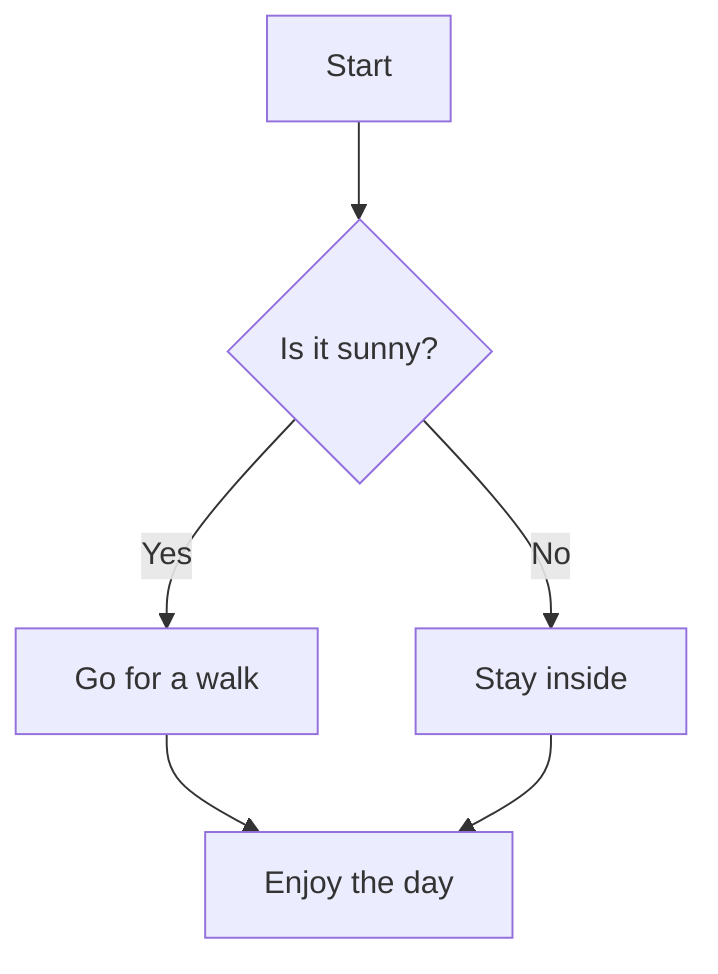
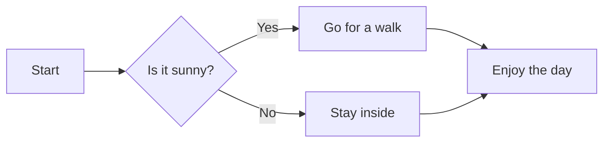
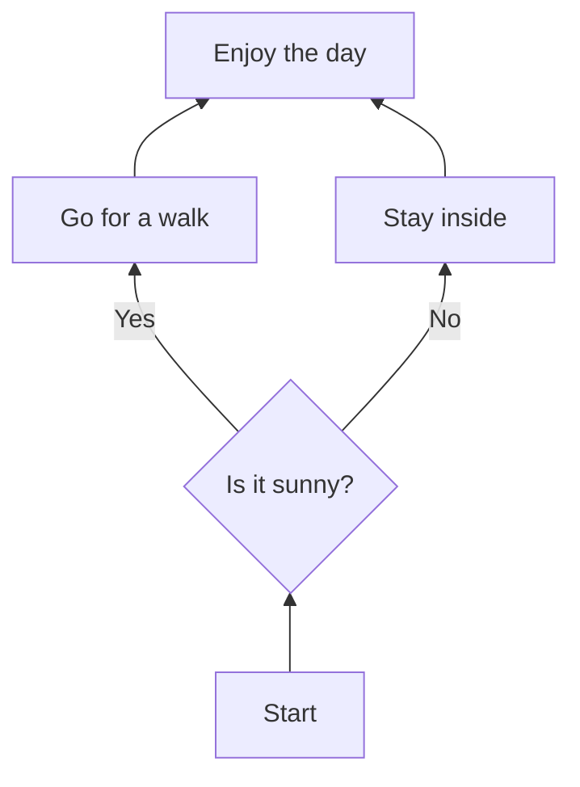
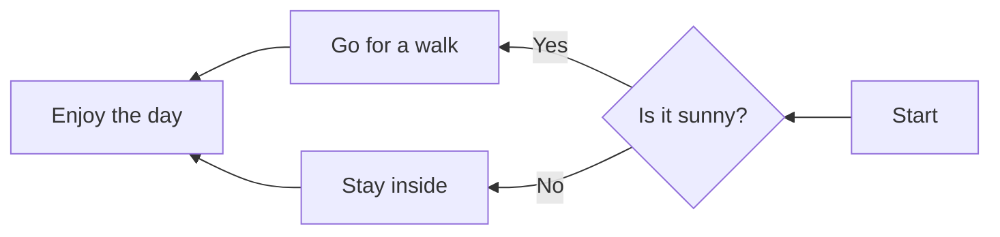
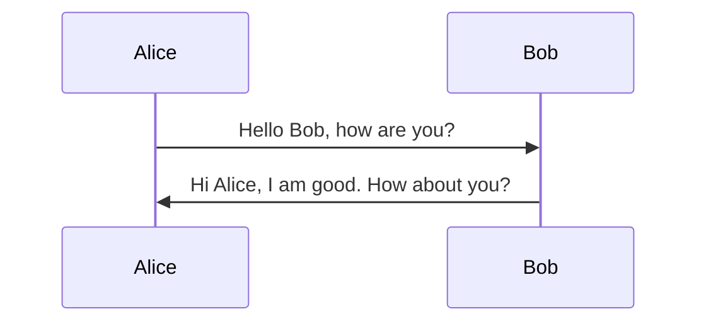
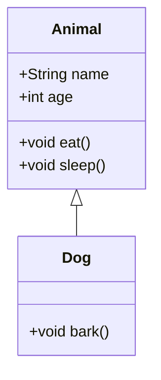
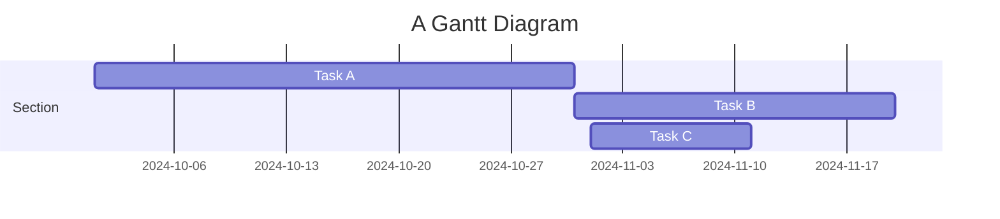
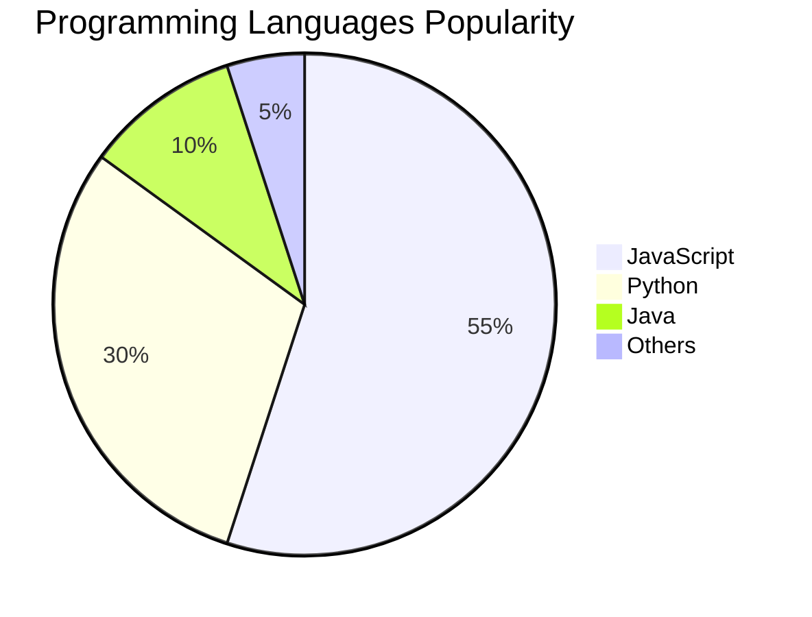

Here's a comprehensive list of Markdown syntax with a brief explanation for each:

## 1. **Headings**
   - `# Heading 1`  
     **Explanation:** Creates a large heading (H1). Use `#` for H1, `##` for H2, and so on up to `######` for H6.
   
## 2. **Paragraphs**
   - `Text`  
     **Explanation:** Text written in a continuous line creates a paragraph. Use blank lines to separate paragraphs.

## 3. **Bold**
   - `**Bold text**` or `__Bold text__`  
     **Explanation:** Makes the text bold.

## 4. **Italic**
   - `*Italic text*` or `_Italic text_`  
     **Explanation:** Makes the text italic.

## 5. **Strikethrough**
   - `~~Strikethrough~~`  
     **Explanation:** Strikes through the text.

## 6. **Links**
   - `[Link Text](URL)`  
     **Explanation:** Creates a hyperlink with custom text.

## 7. **Images**
   - ``  
     **Explanation:** Embeds an image with alt text.

## 8. **Unordered List**
   - `- Item` or `* Item` or `+ Item`  
     **Explanation:** Creates an unordered list with bullets.

## 9. **Ordered List**
   - `1. Item`  
     **Explanation:** Creates an ordered list with numbered items.

## 10. **Blockquote**
   - `> Blockquote text`  
     **Explanation:** Creates a blockquote, typically used for quotes or citations.

## 11. **Code (Inline)**
   - `` `Code` ``  
     **Explanation:** Displays a word or phrase as inline code.

## 12. **Code Block**
   - ```  
     ```  
     Code Block  
     ```  
     **Explanation:** Creates a block of code, often used for multiple lines of code.

## 13. **Horizontal Rule**
   - `---` or `***` or `___`  
     **Explanation:** Creates a horizontal line or rule.

## 14. **Table**
   - `| Header 1 | Header 2 |`  
     `|-----------|-----------|`  
     `| Row 1, Col 1 | Row 1, Col 2 |`  
     **Explanation:** Creates a table with rows and columns.

## 15. **Escaping Characters**
   - `\*Escaped asterisk\*`  
     **Explanation:** Escapes Markdown characters, so they are displayed literally (e.g., `\*`).

## 16. **Task Lists**
   - `- [ ] Task`  
     **Explanation:** Creates a task list with checkboxes.

## 17. **Footnotes**
   - `Text[^1]`  
     `[^1]: Footnote text`  
     **Explanation:** Adds footnotes to the text.

## 18. **HTML**
   - `<div>HTML element</div>`  
     **Explanation:** You can include raw HTML in Markdown.

## 19. **Inline HTML Links**
   - `<a href="URL">Link Text</a>`  
     **Explanation:** Creates a hyperlink using HTML tags.

## 20. **Definition List**
   - `Term : Definition`  
     **Explanation:** Creates a definition list (less common, but supported in some Markdown parsers).

## 21. **Comments**
   - `<!-- Comment -->`  
     **Explanation:** Adds a comment, which won't be rendered in the output.

## 22. **Syntax Highlighting for Code Blocks**
   - ```python  
     def example():  
       pass  
     ```  
     **Explanation:** Adds syntax highlighting to code blocks (language-specific).

This is a full list of the basic Markdown syntax! If you need examples for specific use cases, feel free to ask.

## 23. Mermaid syntax

Mermaid syntax is used to create diagrams such as flowcharts, sequence diagrams, Gantt charts, and more, using plain text. Here are some common types of diagrams and their syntax:

### 1. **Flowchart**


Yes, in Mermaid, you can change the orientation of flowcharts with these options:

- **TD** (Top to Bottom): Default, flows from top to bottom.
- **LR** (Left to Right): Flows from left to right.
- **BT** (Bottom to Top): Flows from bottom to top.
- **RL** (Right to Left): Flows from right to left.

Here’s how each orientation looks with syntax examples:

#### Left to Right (LR)


#### Bottom to Top (BT)


#### Right to Left (RL)


By selecting different orientations, you can customize how the nodes are laid out in the diagram to best fit your layout or presentation needs.

### 2. **Sequence Diagram**


### 3. **Class Diagram**


### 4. **Gantt Chart**


### 5. **Pie Chart**


Each diagram type has its unique syntax, but the basic structure remains consistent, making it easy to create a variety of diagrams. You can use Mermaid with Markdown by embedding the syntax within code blocks (` ```mermaid ... ``` `) in compatible Markdown editors.